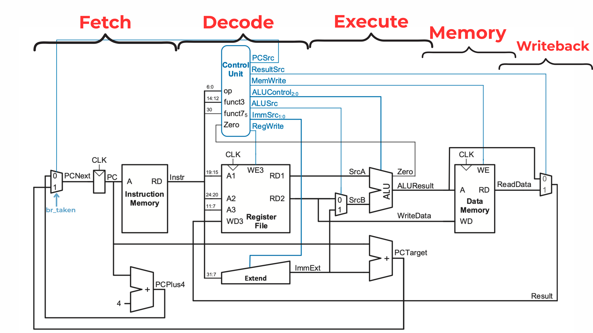

# RISCV_Single_Cycle
Implemented a RISC-V Single Cycle Processor. Specifications: 32-bit datapath, single-cycle execution, Harvard architecture, supporting arithmetic, logic, memory access, and branch instructions

